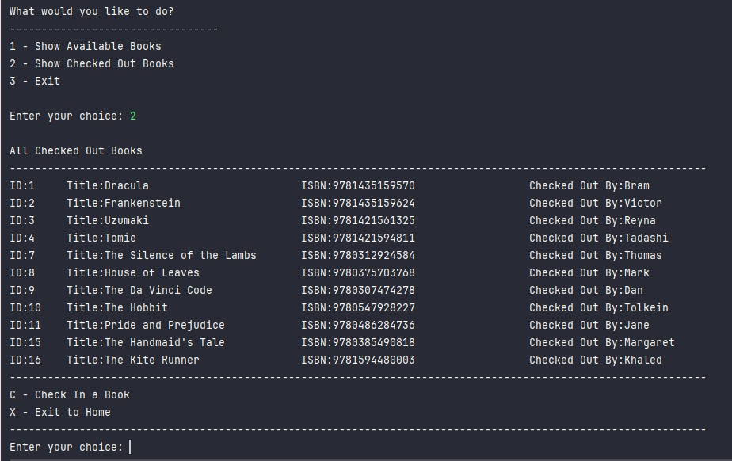

# Neighborhood-library

### What is the neighborhood library?
The Neighborhood Library is a free library with 20 books to choose from.
Anyone is welcomed to view all available books and check out a book of their choice! Or if a book is already checked out you're able to check it back in. 

## Process
> Beginning stages: an idea on how I wanted my display to function/look like


>Skeleton view on how I would implement my book class


## Screenshots





## Code 
> `Book` Class has all information about each book 
```java
    private int id;
    private String isbn;
    private String title;
    private boolean isCheckedOut;
    private String checkedOutTo;
```


>**Interest Piece:** When I first started this project my availableBooks method originally had the code below.
However, I realized that it was doing two completely different objectives. It was displaying and checking out a book. 
I decided to create a new method instead, making it easier to understand and focus on each objective at hand.

```java
public static void checkOutDisplay(Book[]books)
    {
    
        System.out.println("-".repeat(68));
        System.out.println("C - Check Out a Book");
        System.out.println("X - Exit to Home");
        System.out.println("-".repeat(68));
        System.out.print("Enter your choice: ");
        String option = userInput.nextLine().strip();

        if(option.equalsIgnoreCase("c"))
        {
            System.out.print("Please enter the ID of the book: ");
            int choice = Integer.parseInt(userInput.nextLine().strip());

            for (Book book : books) {
                if (book.getId() == choice) {
                    System.out.print("What is your name? ");
                    String name = userInput.nextLine().strip();
                    book.checkOut(name);
                }
            }
        }
        else if (option.equalsIgnoreCase("x"))
        {
            System.out.println("Back to Home Menu! ");
        }
        else
        {
            System.out.println("Invalid selection...Back to Home Menu!");
        }
    }
```


